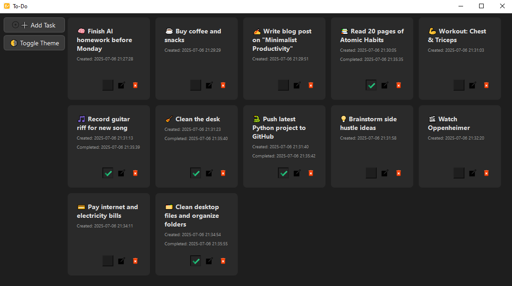
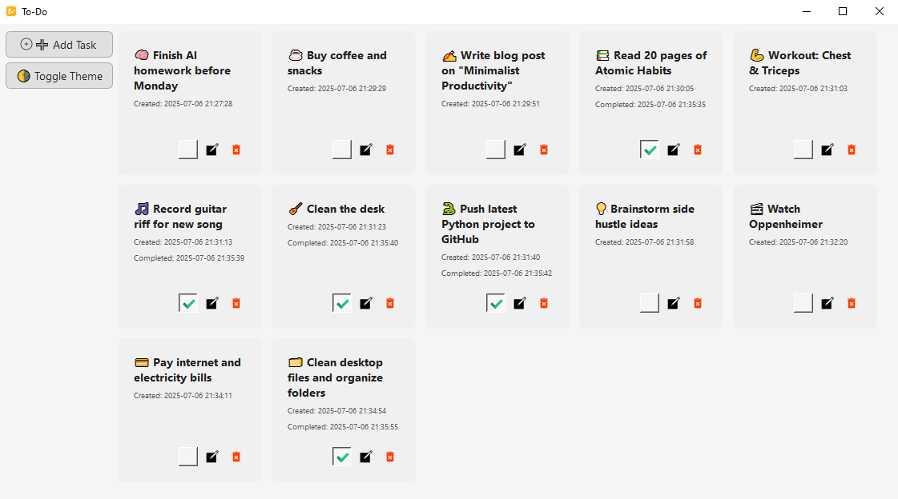

# 📝 PyQt6 To-Do App

A modern, responsive To-Do List desktop application built with **Python** and **PyQt6**. Designed with a focus on clean visuals, adaptive layout, and a good user experience.

---

## 🌟 Features

- 🃏 **Card-Based Interface** – Tasks are displayed as elegant square cards.
- 🌓 **Light & Dark Themes** – Switch between modern light/dark modes with a single click.
- ✅ **Mark as Done** – Stylish icon-based toggle with completion timestamp.
- ✏️ **Edit or Delete** – Modify or remove tasks directly from the card.
- 📅 **Timestamps** – Shows creation and completion times on each card.
- 🧩 **Responsive Layout** – Task cards automatically wrap to fit window size.
- 💾 **Persistent Storage** – Tasks are saved in a local JSON file.

---

## 📦 Project Structure

```
📁 your-todo-app/
├── main.py              # Main app and GUI logic
├── tasks.py             # Task loading and saving (JSON)
├── tasks.json           # ✅ Data file for storing all tasks
├── style_dark.qss       # QSS file for dark theme
├── style_light.qss      # QSS file for light theme
├── res/                 # Folder for icons (.svg or .png)
│   ├── add.png
│   ├── done.svg
│   ├── edit.png
│   ├── app.png
│   └── remove.png
└── README.md            # App instructions, usage, and screenshots
```

---

## 🛠 Requirements

- Python 3.10+
- PyQt6

Install with:

```bash
pip install PyQt6
```

---

## ▶️ How to Run

```bash
python main.py
```

---

## 📷 Screenshots

### 🔲 Dark Theme

### ⬜ Light Theme


---

## 📄 License

MIT License. Free to use, modify, and share.

---

## 🙌 Credits

Built with ❤️ by [Noro].
